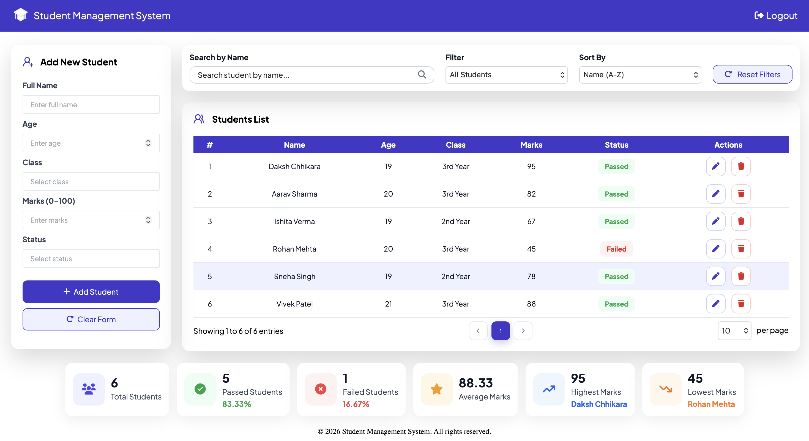

# 🎓 Student Record Manager

A modern and clean **Student Record Manager Dashboard** built using **HTML5** and **CSS3**. The project focuses on creating a professional dashboard interface for managing student records with a simple, intuitive, and visually appealing design.

> **Note:** This project currently contains only the frontend UI. JavaScript functionality and responsive design will be added in future updates.

---

# 📸 Preview

## 🔐 Login Page


---

## 📊 Dashboard



---

# ✨ Features

### 🔐 Login Page
- Modern login interface
- Clean card-based design
- Email & Password fields
- Remember Me option
- Forgot Password link
- Social Login Buttons

### 📝 Student Form
- Add New Student form
- Name
- Age
- Class
- Marks
- Status
- Add Student button
- Clear Form button

### 🔍 Search & Filter
- Search by Name
- Filter Students
- Sort Students
- Reset Filters

### 📋 Student List
- Student records table
- Status badges
- Edit button
- Delete button
- Pagination UI

### 📊 Statistics Cards
- Total Students
- Passed Students
- Failed Students
- Average Marks
- Highest Marks
- Lowest Marks

---

# 🛠️ Built With

- HTML5
- CSS3
- Flexbox
- Google Fonts (Plus Jakarta Sans)
- Font Awesome
- Lucide Icons

---

# 📂 Project Structure

```text
student-management-system/
│
├── index.html
├── style.css
├── dashboard.html
├── dashboard.css
├── script.js
│
├── screenshots/
│   ├── loginpageui.png
│   └── dashboardui.png
│
├── books.png
├── dashboardui.png
├── hlogo.png
├── image.png
├── leftback.png
├── loginpageui.png
├── mail.png
├── studentlogo.png
└── README.md
```

---

# 🚀 Current Status

## ✅ Completed

- Login Page UI
- Dashboard UI
- Student Form
- Search Section
- Student Table
- Pagination UI
- Statistics Cards

## 🔄 Planned

- Add Student
- Edit Student
- Delete Student
- Search Functionality
- Filter Functionality
- Sorting
- Pagination Logic
- Responsive Design
- Local Storage
- Backend Integration

---

# 📚 Learning Outcomes

This project helped me practice:

- Semantic HTML
- CSS Flexbox
- CSS Box Model
- Forms
- Tables
- Dashboard UI Design
- Git & GitHub Workflow

---

# 📄 License

This project is created for learning and portfolio purposes.

---

# 👨‍💻 Author

**Daksh Chhikara**
